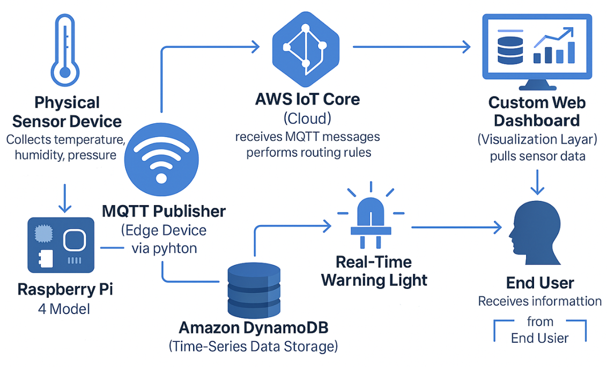
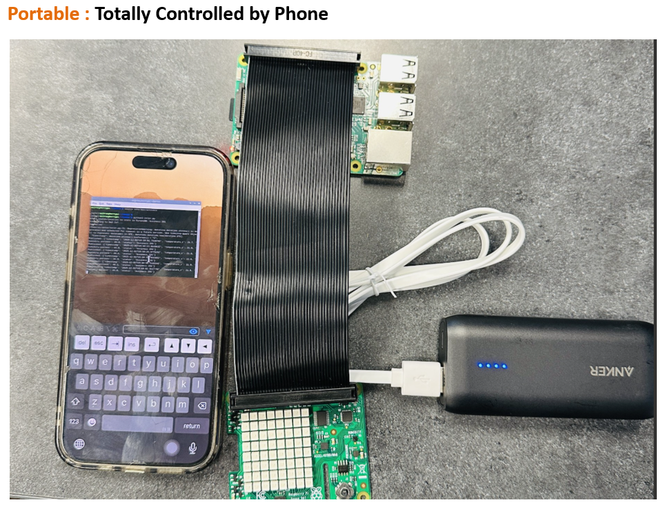
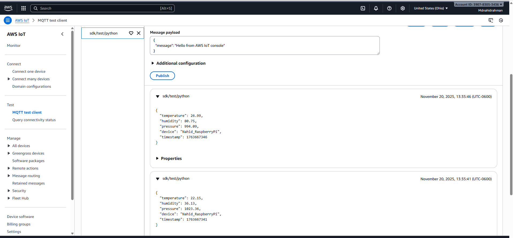
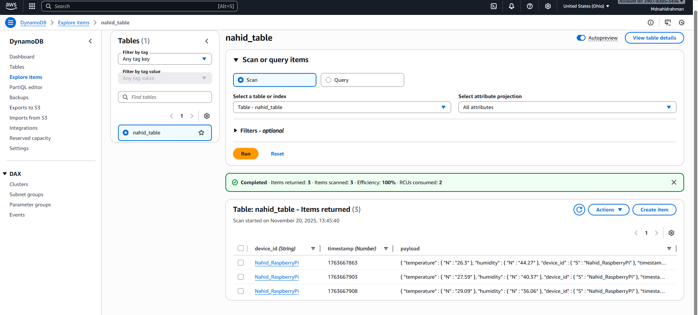
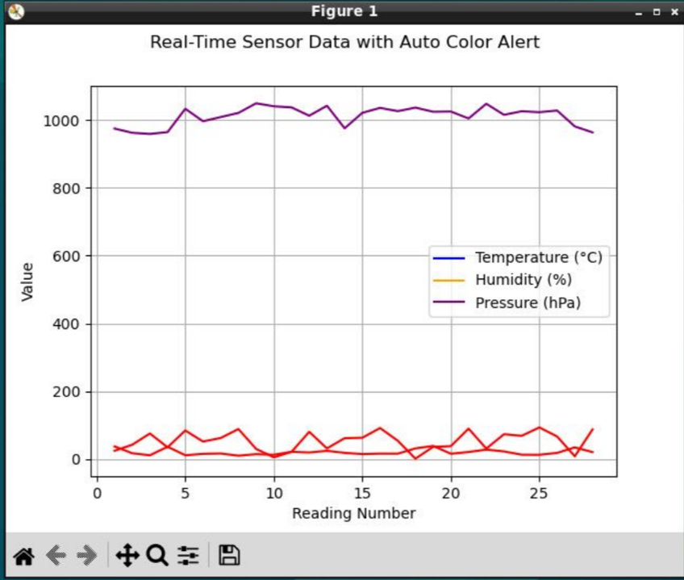
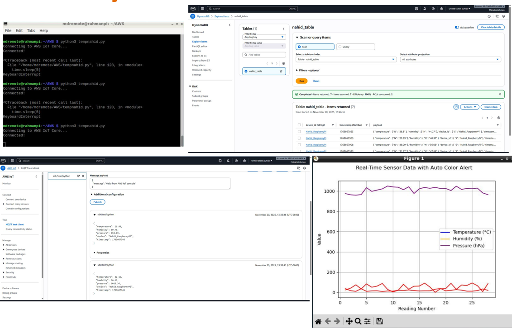

# 🌡️ Portable IoT Environmental Monitor
### Real-Time Temperature & Humidity Monitoring System — AWS Cloud + Raspberry Pi 4


---



## 📌 Project Overview

A **portable, low-cost IoT solution** for real-time environmental monitoring of indoor spaces such as grocery stores, offices, student buildings, and homes. The system collects **temperature, humidity, and pressure** data every 5 seconds using a Raspberry Pi 4 with a Sense HAT sensor, streams it securely to **AWS IoT Core** via MQTT, stores it in **Amazon DynamoDB**, and visualizes it on a custom web dashboard — all controllable from a smartphone with no monitor, keyboard, or mouse required.

> 💡 **Cost Advantage:** Our system costs **$80–$90** to build vs. market alternatives at **$360–$600**

---

## 🏗️ System Architecture

```
┌─────────────────────┐       MQTT / TLS        ┌──────────────────────┐
│   Raspberry Pi 4    │ ──────────────────────▶  │    AWS IoT Core      │
│   + Sense HAT       │   sdk/test/python topic   │  (Message Routing)   │
│   (Edge Device)     │                           └──────────┬───────────┘
│                     │                                      │ SQL Rule
│  • Temperature °C   │                           ┌──────────▼───────────┐
│  • Humidity %RH     │                           │   Amazon DynamoDB    │
│  • Pressure hPa     │                           │   (nahid_table)      │
└──────────┬──────────┘                           │  PK: device_id       │
           │                                      │  SK: timestamp       │
           │ Local Visual Alert                   └──────────┬───────────┘
           ▼                                                 │
   ┌───────────────┐                             ┌──────────▼───────────┐
   │  LED Matrix   │                             │  Custom Web Dashboard│
   │  (Sense HAT)  │                             │  Python Matplotlib   │
   │  "All OK" /   │                             │  Real-Time Charts    │
   │  "Cold" Alert │                             └──────────────────────┘
   └───────────────┘
```

---

## 🔧 Hardware Components



| Component | Description |
|-----------|-------------|
| **Raspberry Pi 4 Model B** | Edge compute device — runs all Python scripts |
| **Sense HAT** | Sensor board — collects temperature (°C), humidity (%RH), pressure (hPa) |
| **Anker Power Bank** | Portable power supply — no outlet needed |
| **iPhone (VNC)** | Remote control interface via secure VNC — no monitor/keyboard required |
| **LED Matrix (Sense HAT)** | Local visual alerts ("All OK" / "Cold") |

---

## ☁️ Cloud Stack



| Service | Role |
|---------|------|
| **AWS IoT Core** | Receives MQTT messages, applies SQL routing rules |
| **Amazon DynamoDB** | NoSQL time-series storage (`nahid_table`) |
| **AWS IoT SQL Rules** | Routes `sdk/test/python` topic → DynamoDB |
| **X.509 Certificates** | Secure device authentication & encrypted communication |

---

## 📡 Communication Flow

1. **Sense HAT** collects environmental readings every **5 seconds**
2. **Python script** (`tempnahid.py`) formats data as JSON and publishes via **MQTT**
3. **AWS IoT Core** receives message on topic `sdk/test/python` and applies SQL rule
4. **DynamoDB** stores each reading as a new item with `device_id` (PK) + `timestamp` (SK)
5. **Dashboard** queries DynamoDB and renders real-time charts via Matplotlib
6. **LED Matrix** displays local visual feedback ("All OK" / warning message)

---

## 📦 JSON Payload Example

```json
{
  "temperature": 26.99,
  "humidity": 80.75,
  "pressure": 994.09,
  "device": "Nahid_RaspberryPi",
  "timestamp": 1763667346
}
```

---

## 🗃️ DynamoDB Schema



```
Table: nahid_table
├── device_id  (String)  — Partition Key  → e.g., "Nahid_RaspberryPi"
├── timestamp  (Number)  — Sort Key       → Unix epoch timestamp
└── payload    (Map)     — All sensor readings
    ├── temperature  (Number)
    ├── humidity     (Number)
    └── pressure     (Number)
```

**Sample records collected:**

| device_id | timestamp | temperature | humidity |
|-----------|-----------|-------------|----------|
| Nahid_RaspberryPi | 1763667863 | 26.3°C | 44.27% |
| Nahid_RaspberryPi | 1763667903 | 27.59°C | 40.37% |
| Nahid_RaspberryPi | 1763667908 | 29.09°C | 36.06% |
| Nahid_RaspberryPi | 1763667973 | 31.67°C | 47.88% |

---

## 📊 Analytics & Visualization



- **Real-time charts** via Python Matplotlib (temperature, humidity, pressure)
- **Auto color alerts** — values outside safe thresholds highlighted in red
- **CSV export** from DynamoDB for Excel or Python analysis
- **JSON export** for programmatic processing
- **Data cleaning pipeline**: Remove missing values → plot trends → compare locations → flag unsafe readings

### Safety Insights Generated

- ✅ Identify poorly ventilated areas
- ✅ Detect humidity levels that may cause mold growth
- ✅ Find overheating zones in buildings
- ✅ Spot atmospheric pressure instability
- ✅ Help building managers diagnose HVAC issues

---

## 🗺️ Deployment Locations

The system was deployed and tested at **7 different locations** across Jonesboro, AR, including:
- Local grocery stores
- Student buildings
- Office environments

---

## 🚀 Getting Started

### Prerequisites

```bash
# Raspberry Pi 4 with Raspberry Pi OS
# Python 3.x installed
pip install AWSIoTPythonSDK sense-hat matplotlib boto3
```

### AWS Setup

1. Create a **Thing** in AWS IoT Core
2. Download X.509 certificate, private key, and root CA
3. Create an **IoT Rule** with SQL: `SELECT * FROM 'sdk/test/python'`
4. Set DynamoDB action → table `nahid_table`, PK = `device_id`, SK = `timestamp`

### Run the Publisher

```bash
# SSH or VNC into your Raspberry Pi
cd ~/AWS
python3 tempnahid.py
# Output: Connecting to AWS IoT Core... Connected!
```

### Visualize Data

```python
import boto3
import matplotlib.pyplot as plt

# Query DynamoDB and plot real-time chart
dynamodb = boto3.resource('dynamodb', region_name='us-east-2')
table = dynamodb.Table('nahid_table')
response = table.scan()
# ... plot temperature, humidity, pressure
```

---

## 📁 Project Structure

```
iot-environmental-monitor/
├── src/
│   ├── tempnahid.py          # Main MQTT publisher script
│   ├── visualize.py          # Real-time Matplotlib dashboard
│   └── data_analysis.py      # CSV export & data cleaning
├── aws/
│   ├── certs/                # X.509 certificates (not committed)
│   └── iot_rule.json         # AWS IoT SQL rule definition
├── docs/
│   ├── architecture.png      # System architecture diagram
│   └── dashboard_demo.png    # Dashboard screenshot
└── README.md
```

---

## 🔒 Security

- **X.509 mutual TLS** authentication between device and AWS IoT Core
- **VNC over encrypted tunnel** for remote device control via smartphone
- **No data exposure** — all communication encrypted end-to-end
- AWS IAM roles scoped to minimum required permissions

---

## 📈 Key Metrics

| Metric | Value |
|--------|-------|
| Sensor reading interval | Every 5 seconds |
| Total locations monitored | 7 |
| Data storage | Amazon DynamoDB (NoSQL) |
| System cost | ~$80–$90 |
| Market equivalent cost | $360–$600 |
| Communication protocol | MQTT over TLS |

---

## 🔮 Future Improvements

- [ ] Add CO₂ / air quality gas sensors
- [ ] SMS or email alerts via AWS SNS when thresholds are exceeded
- [ ] Machine learning anomaly detection (AWS SageMaker)
- [ ] 3D-printed portable enclosure for the device
- [ ] Multi-device fleet management via AWS IoT Fleet Hub
- [ ] Mobile app dashboard (React Native)

---

## 🎬 System in Action



---

## 👥 Team

| Name | Role |
|------|------|
| **Nahid** | Hardware setup, AWS IoT Core, Python MQTT publisher, DynamoDB integration |
| **Rohil** | Data analysis, dashboard visualization, system testing, documentation |

**Course:** IoT & Blockchain — Arkansas State University
**Semester:** Fall 2025

---

## 📄 License

This project is licensed under the MIT License — see the [LICENSE](LICENSE) file for details.

---

*Built with ❤️ using Raspberry Pi 4, AWS IoT Core, and Python*
